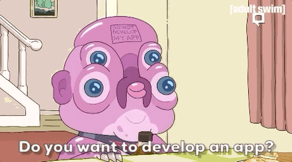

    

    

 
<h1>Hey there! 👋🏻</h1>

I'm **Lucas Arroyo**, a spanish young **Web App Developer** excited to work in new projects!

### 🙋🏻‍♂️ About me:

I consider myself a very creative person, passionate about technology, and constantly learning.

This year, I had the opportunity to participate in the Erasmus+ program in the city of Brno, Czech Republic, and intern at the company [Continero](https://www.continero.com/en/), where I developed a complete project in ASP.NET using the Blazor framework to manage the databases of their main application, [Tomtit](https://www.tomtit.app/).

### 💻 Latest Projects:

#### SongSpotter
##### *May 2023 - Present*

SongSpotter is a web application developed in Blazor that allows users to discover new songs in a simple and fun way, providing a fully personalized experience.

My role in this project is that of founder and co-creator, as well as the lead developer for both the back-end and front-end of the application.

#### Hola Nerds
##### *November 2022 - Present*

Hola Nerds is a technology website created with WordPress that focuses on providing its readers with news, reviews, and analysis of technology products and services.

As a developer on the project, I played a central role in the creation and optimization of the website, as well as actively improving the page layouts with CSS.

### 🛠️ Languages and Technologies:

   &nbsp;
   &nbsp;
   &nbsp;
   &nbsp;
   &nbsp;
   &nbsp;
   &nbsp;
   &nbsp;
   &nbsp;
   &nbsp;

### 🤝 Let's work together!

    

Let's connect in [LinkedIn](https://www.linkedin.com/in/lucas-arroyo-174a28196/)! I want to start new projects and face new challenges 😊